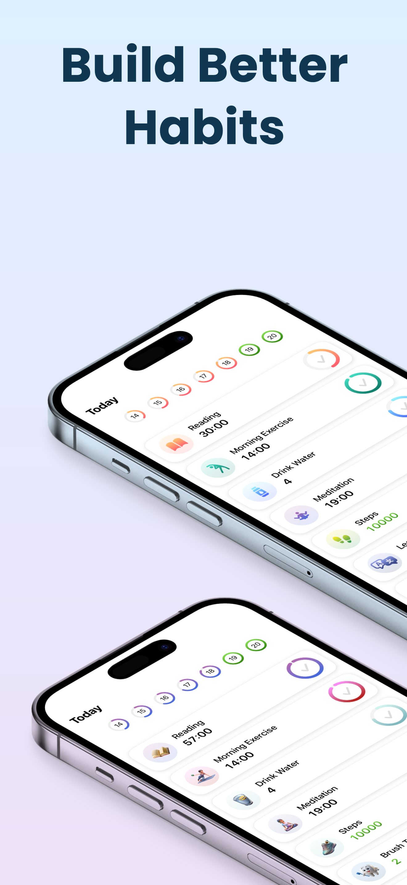
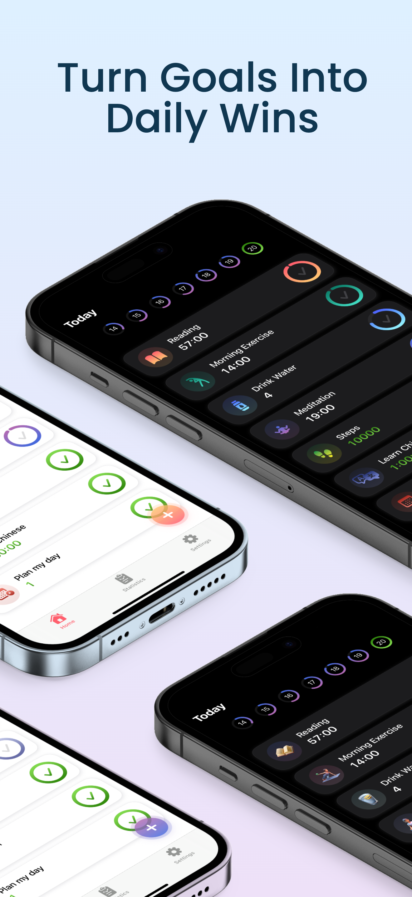
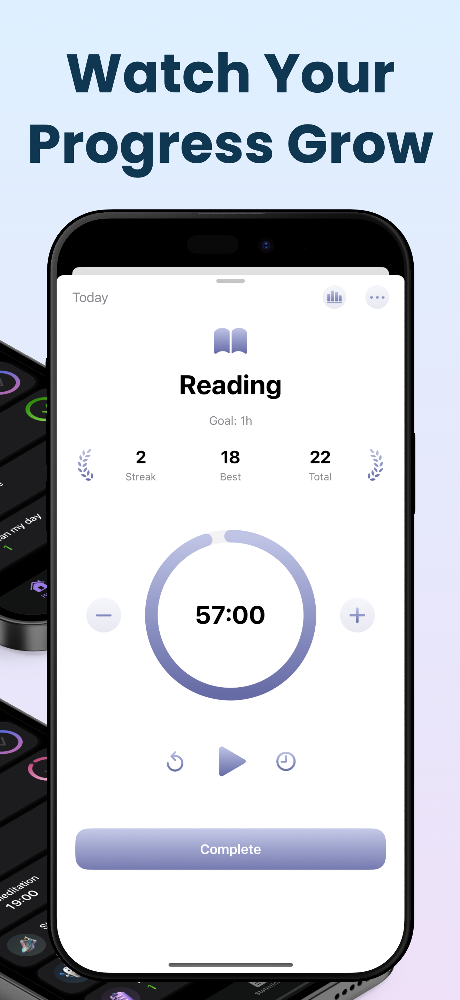
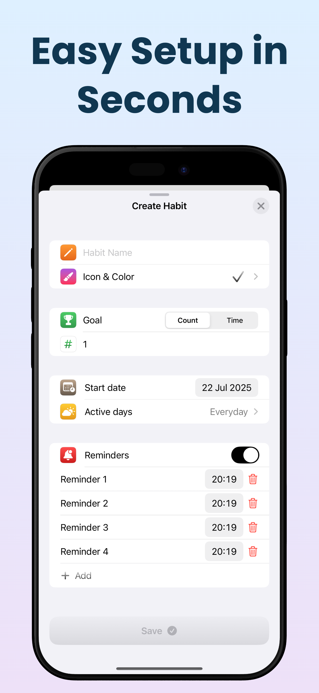
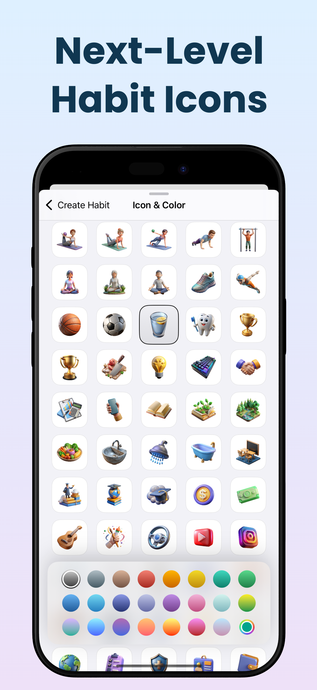
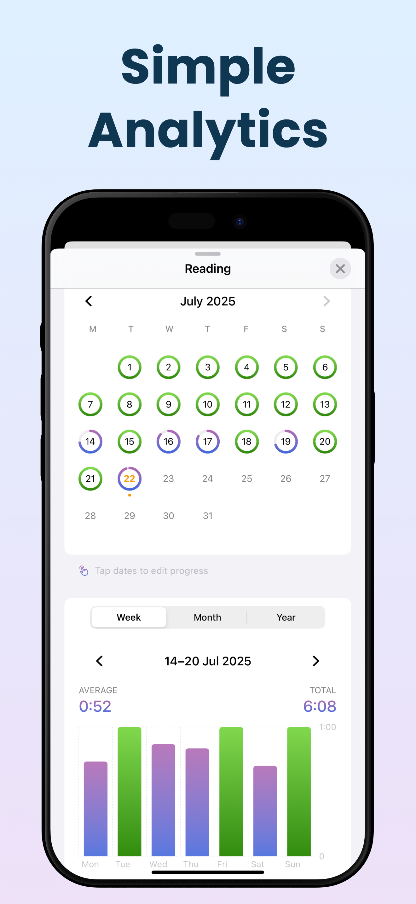
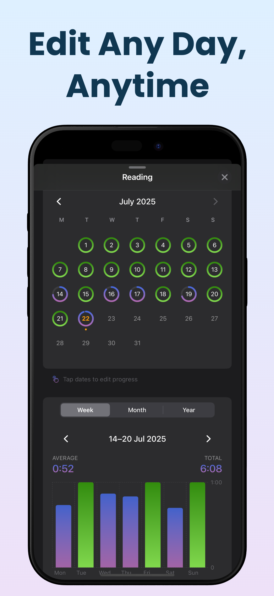
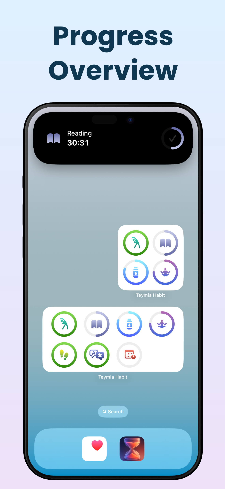

# rutin - iOS Habit Tracker

A personal iOS project exploring modern Apple technologies. Full-cycle development from prototype to App Store publication.

## 📱 Screenshots

<div align="center">
  
  
  
  
</div>

<div align="center">
  
  
  
  
</div>

<p align="center">
  <a href="https://apps.apple.com/app/teymia-habit/id6746747903">
    
  </a>
</p>

## 🚀 Download

<p align="center">
  <a href="https://apps.apple.com/app/teymia-habit/id6746747903">
    
  </a>
</p>

**⭐ Or build from source using the instructions below!**

## ✨ Features

### Core Features
- **Multiple habit types**: Counters and timers with concurrent execution
- **Smart scheduling**: Configure active days per habit
- **Cloud sync**: CloudKit integration for seamless multi-device experience
- **Analytics**: Detailed statistics with charts and calendar views
- **Security**: Biometric protection with Face ID/Touch ID
- **Data export**: Export habit data in CSV, JSON, or PDF formats
- **Archive system**: Organize completed/inactive habits  
- **Completion sounds**: Audio feedback with custom sound selection
- **Haptic feedback**: Enhanced tactile user experience

### Pro Features  
- **Unlimited habits** (Free: 3 habits)
- **Advanced statistics** with detailed charts
- **Multiple reminders** per habit
- **Premium 3D icons** for habits
- **Custom app themes** and colors
- **Data export** in multiple formats
- **Lifetime purchase** option

## 🎯 About Project

Personal project for practicing iOS development with modern Apple stack. Complete development cycle from concept to App Store - UI/UX design, architecture implementation, and monetization.

**Inspiration**: Based on popular habit tracking apps but built from scratch to explore architectural patterns and modern iOS APIs.

## 🛠 Tech Stack

### Core Technologies
- **SwiftUI** + **@Observable** - modern reactive architecture
- **SwiftData** - local persistence with automatic migrations
- **CloudKit** - data synchronization with conflict resolution
- **ActivityKit** - Live Activities for Lock Screen and Dynamic Island
- **WidgetKit** - Home Screen widgets

### Architecture & Patterns
- **MVVM** with clear separation of concerns
- **Dependency Injection** via SwiftUI Environment
- **Protocol-Oriented Design** for testability
- **Service Layer** for business logic

### Business Logic
- **RevenueCat** - subscription and purchase management
- **UNUserNotificationCenter** - smart notification scheduling
- **HapticManager** - contextual haptic feedback

## 📱 Requirements

- **iOS 18.0+**
- **Xcode 16.0+**
- **Swift 5.10+**

## 🔧 Installation

### Quick Setup

```bash
# Clone repository  
git clone https://github.com/amanbayserkeev0377/Teymia-Habit.git
cd Teymia-Habit

# Open in Xcode
open rutin.xcodeproj

# Build and run (⌘+R)
```

### Configuration

#### 1. RevenueCat (Optional)
Update `RevenueCatConfig.swift` for in-app purchases:
```swift
static let apiKey = "YOUR_REVENUECAT_API_KEY"
```

#### 2. CloudKit (Optional)
Works with any Apple ID, but for production update the CloudKit container identifier.

## 🏗 Project Structure

```
rutin/
├── App/                    # App configuration
├── Models/                 # SwiftData models
├── Views/                  # SwiftUI views
├── ViewModels/             # MVVM view models
├── Managers/               # Core managers
├── Services/               # Business logic
├── UI Components/          # Reusable components
├── Extensions/             # Swift extensions
├── Pro/                    # Premium features
├── LiveActivity/           # Live Activities
└── rutinWidgets/     # Widget extensions
```

## 🚀 Technical Highlights

### Modern iOS Implementation
- **SwiftData with CloudKit** - seamless sync with conflict resolution
- **Live Activities + Dynamic Island** - iOS 18 integration with real-time updates
- **Concurrent timer execution** - multiple habits running simultaneously
- **Background persistence** - state maintained across app lifecycle
- **Memory-optimized calendar** - efficient rendering for large date ranges

### Key Technical Decisions
- **@Observable over Combine** - simpler state management without reactive complexity
- **Protocol-first architecture** - testable and flexible component design
- **Single dependency principle** - only RevenueCat for subscription handling
- **SwiftData migrations** - smooth schema evolution without data loss

### Production Ready Features
- **Complete freemium implementation** with feature gating
- **RevenueCat integration** - subscriptions, lifetime purchases, trial handling
- **Biometric security** - Face ID/Touch ID with custom passcode fallback
- **16-language localization** - including RTL support considerations
- **Accessibility compliance** - VoiceOver and Dynamic Type support

## 🌍 Localization

Currently supports 16 languages including:
- 🇺🇸 English • 🇷🇺 Russian • 🇰🇬 Kyrgyz • 🇰🇿 Kazakh
- 🇨🇳 Chinese (Simplified, Traditional, Hong Kong)
- 🇪🇸 Spanish • 🇫🇷 French • 🇩🇪 German • 🇧🇷 Portuguese
- 🇯🇵 Japanese • 🇰🇷 Korean • 🇮🇳 Hindi • 🇹🇷 Turkish
- 🇻🇳 Vietnamese • 🇮🇹 Italian • 🇮🇩 Indonesian

## 💰 Business Model

Implemented complete freemium monetization:
- **Free tier**: 3 habits with basic features
- **Subscription**: Monthly/yearly plans with 7-day trial
- **Lifetime**: One-time purchase option
- **Feature gating**: Throughout the app with upgrade prompts

## 🎨 Design Approach

- **Apple HIG compliance** with native iOS patterns
- **Adaptive design** supporting all iPhone screen sizes
- **Dark/Light theme** with custom color schemes
- **Accessibility first** with VoiceOver support
- **Smooth animations** enhancing user experience

## 📊 Development Insights

### Challenges Solved
- **CloudKit + SwiftData synchronization** - reliable conflict resolution across devices
- **Live Activities state consistency** - maintaining timer accuracy across app states  
- **Widget data synchronization** - App Groups with real-time updates
- **Background timer precision** - iOS background execution limitations
- **Memory optimization** - efficient calendar rendering for years of data

### Performance Considerations
- **Lazy loading** for historical data views
- **Smart caching** for frequently accessed statistics
- **Efficient Core Data predicates** for large datasets
- **Background task optimization** for timer persistence

### Current Limitations
- iOS-only implementation (Apple ecosystem focus)
- Zero third-party dependencies except RevenueCat for subscriptions
- Prioritized simplicity over complex optimizations

## 📄 License

MIT License - see [LICENSE](LICENSE) file for details.

## 📧 Contact

- **App Store**: [rutin](https://apps.apple.com/app/teymia-habit/id6746747903)
- **Issues**: Use GitHub Issues for technical questions

---

*Pet project showcasing modern iOS development practices and full app lifecycle management.*
# Rutin-App
